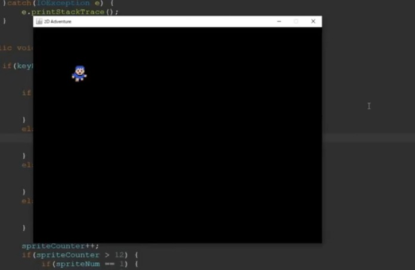

# 🎮 Projeto: Construindo Jogo 2D em Java

Este projeto é uma implementação prática da série **"How to Make a 2D Game in Java"** criada por [RyiSnow no YouTube](https://www.youtube.com/@RyiSnow), com o objetivo de ensinar os conceitos fundamentais por trás da criação de jogos 2D utilizando Java puro (sem bibliotecas externas de jogos).



## 📌 Episódio Base

- 🎥 [How to Make a 2D Game in Java #1 - The Mechanism of 2D Games](https://www.youtube.com/watch?v=om59cwR7psI&list=PL_QPQmz5C6WUF-pOQDsbsKbaBZqXj4qSq&index=1)

## 🚀 Funcionalidades Implementadas

- Loop de jogo com lógica de FPS fixa
- Sistema de atualização e renderização de sprites
- Movimento básico do personagem principal com animação
- Gerenciamento de entradas pelo teclado (KeyHandler)

## 🛠️ Tecnologias Utilizadas

- Java (JDK 17 ou superior recomendado)
- IDE recomendada: IntelliJ IDEA ou Eclipse
- Swing para renderização gráfica
- `BufferedImage` para manipulação de sprites

## 📂 Estrutura Básica do Projeto
src/
├── Main.java
├── GamePanel.java
├── KeyHandler.java
├── Player.java
└── ... (demais classes)


## ▶️ Como Rodar o Projeto

1. Clone este repositório:
   ```bash
   git clone https://github.com/seu-usuario/jogo-2d-java.git
   cd jogo-2d-java

2. Compile os arquivos Java:
javac src/* .java

3. Execute o jogo:
java -cp src Main

💡 Certifique-se de que suas imagens estejam na pasta res/ e referenciadas corretamente no código.

🎯 Próximos Passos
Implementar colisão com o mapa

Adicionar tiles e mapa do mundo

Criar sistema de NPCs e diálogos

Inventário e combate

📸 Capturas de Tela
Você pode visualizar uma demonstração do jogo abaixo:


📽️ Demonstração em Vídeo
Vídeo da execução atual do projeto:

(Você pode adicionar o vídeo [2025-06-22 19-11-35.mp4] no GitHub ou converter para GIF e adicionar aqui)

🧑‍💻 Autor
Desenvolvido por Francisco de Assis


